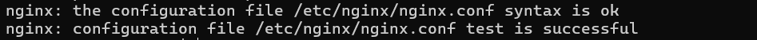
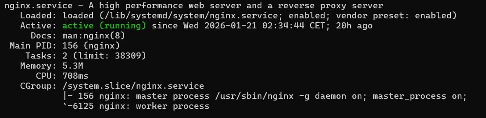
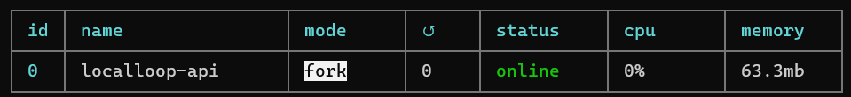
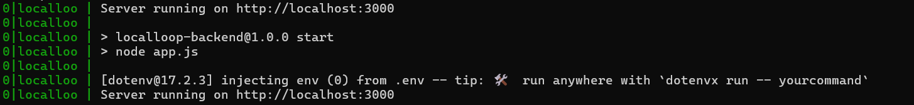
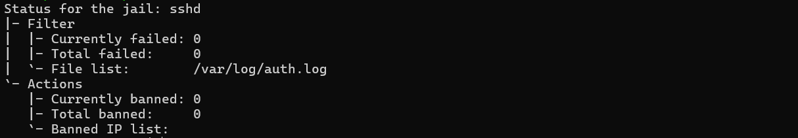

# Guide de déploiement
Guide de déploiement d'une application React avec PostgreSQL sous Linux

## Présentation de l'application

**Localloop** est une application web collaborative de **parcours de découverte**. Elle permet de découvrir, créer et partager des parcours authentiques.

Cette application web utilise :

- Frontend : Application React/Vite
- Backend : API Node.js avec Express
- Base de données : PostgreSQL
- ORM : Prisma

L'application repose sur une architecture client-serveur où le frontend communique avec le
backend via des requêtes HTTP, et le backend interroge la base de données PostgreSQL.

## Objectif du guide

Ce guide vous accompagne dans le déploiement de l'application LocalLoop sur un serveur distant,
de l'installation de l'environnement jusqu'à la mise en production de l'application avec un serveur web NGINX.

Le guide suivra le déroulé suivant :

## Etapes du guide
1. [Prérequis](#1-prérequis)
2. [Préparation du serveur](#2-préparation-du-serveur)
3. [Configuration de la base de données PostgreSQL](#3-configuration-de-la-base-de-données-postgresql)
4. [Backend et API](#4-backend-et-api)
5. [Déploiement de l’application React](#5-déploiement-de-lapplication-react)
6. [Mise en production](#6-mise-en-production)
7. [Sécurisation de l’environnement](#7-sécurisation-de-lenvironnement)
8. [Sécurisation de la connexion](#8-sécurisation-de-la-connexion)
9. [Résolution des problèmes courants](#9-résolution-des-problèmes-courants)
10. [Conclusion](#10-conclusion)

---

## 1. Prérequis
### Matériel et accès :

- Un VPS Linux (Ubuntu)
- Accès SSH au serveur
- Droits sudo pour l’installation des dépendances système
- Nom de domaine

### Environnement :

- NodeJs, npm, postgresql, nginx, pm2, git, vim, fail2ban.

La section suivante vous guide dans la mise en place l'environnement sur votre serveur.

---

## 2. Préparation du serveur

### 2.1. Mise à jour du serveur
```bash
sudo apt update
sudo apt upgrade
```

### 2.2. Mise en place de l'environnement

#### Installation de NodeJs
La documentation de NodeJs est disponible ici : [nodejs](https://nodejs.org/fr/download)

Afin de gérer facilement les versions de NodeJs et d’assurer la compatibilité avec l’application, NodeJs est installé via nvm (Node Version Manager).

Télécharger et installer nvm :
```bash
curl -o- https://raw.githubusercontent.com/nvm-sh/nvm/v0.40.3/install.sh | bash
```

Charger nvm dans le shell actuel. Redémarrer le terminal ou exécuter :
```bash
\. "$HOME/.nvm/nvm.sh"
```

Télécharger et installer Node.js :
```bash
nvm install 22.21.0
```
La version 22.21.0 de Node.js est installée pour garantir la cohérence entre l’environnement local et l’environnement de production. Cela permet d'éviter les comportements inattendus liés au changement de version.

Vérifier l'installation :
```bash
node -v # Doit afficher "v22.21.0"
npm -v # Doit afficher "10.9.4"
```

#### Installation de postgresql
La documentation de PostgreSQL est disponible ici : [postgresql](https://www.postgresql.org/download/linux/ubuntu/)

```bash
sudo apt install postgresql
postgresql -V #vérifier l'installation
```

#### Installation de NGINX
```bash
sudo apt install nginx
nginx -v #vérifier l'installation
```

Démarrer et activer NGINX
```bash
sudo systemctl start nginx
sudo systemctl enable nginx
```

#### Installation de PM2

La documentation de PM2 est disponible ici : [PM2](https://pm2.keymetrics.io/docs/usage/quick-start/)

```bash
npm install pm2 -g
```

#### Installation de Git
```bash
sudo apt install git
git --version  # Vérifier l'installation
```

#### Installation de Vim
```bash
sudo apt install vim
```

#### Installation de fail2ban
Voir détails dans la section : [Sécurisation de l’environnement](#7-sécurisation-de-lenvironnement)
```bash
sudo apt install fail2ban
```

### 2.3. Configuration du pare-feu :

La configuration du pare-feu fait partie des mesures de sécurité recommandées pour un serveur en production.

Dans le cadre de ce projet, cette étape n’a pas encore été implémentée,
mais elle est prévue pour une mise en place ultérieure.

Le principe consiste à :
- Autoriser uniquement les ports nécessaires au fonctionnement de l’application,
- S'assurer que l'accès SSH est correctement configuré avant l'activation, afin d’éviter toute perte d’accès au serveur,
- Appliquer la configuration et vérifier le statut du pare-feu

---

## 3. Configuration de la base de données PostgreSQL

Se connecter à PostgreSQL
```bash
psql -U postgres
```

Une fois connecté dans psql, on peut créer la base de données :
```bash
CREATE DATABASE localloop_db;
```

On peut créer un utilisateur dédié pour cette base de données, par exemple : localloop_user :
```bash
CREATE USER localloop_user WITH PASSWORD 'VotreMotDePasse';
```
C'est une mesure de sécurité, cet utilisateur ne peut intervenir que sur la base localloop_db,
même si l'application est compromise, les autres bases resteront protégées.

On peut ensuite donner les droits à l'utilisateur pour être le propriétaire de la base... :
```bash
ALTER DATABASE localloop_db OWNER TO localloop_user;
```

... et se connecter à la base :
```bash
\c localloop_db
```

On donne les droits à l'utilisateur sur le schéma public (pour créer et manipuler les tables) :
```bash
GRANT ALL ON SCHEMA public TO localloop_user;
ALTER SCHEMA public OWNER TO localloop_user;
```

Quitter psql :
```bash
\q
```

Pour information, la commande de connexion à la base avec l'utilisateur créé est :
```bash
psql -U localloop_user -d localloop_db -h localhost -W
```

On appliquera les migrations depuis le dossier backend.

---

## 4. Backend et API

### 4.1. Récupération et préparation du code frontend

Dans le dossier /var/www/ créer un dossier localloop et deux sous-dossiers : backend et frontend, pour déployer les deux repositories.

Définir le propriétaire et les droits du dossier, pour que le serveur web puisse lire les fichiers sans compromettre la sécurité :

```bash
sudo chown user /var/www/localloop
sudo chmod -R 755 /var/www/localloop
```

Dans le dossier backend, cloner le repository backend :
```bash
git clone https://github.com/sophie-rud/localloop-backend.git .
```

Créer le fichier .env en suivant ce modèle :
```bash
sudo .env
```
```bash
# DB
DATABASE_URL="postgresql://[utilisateur]:[mot_de_passe]@[hôte]:[port]/[nom_base]"

# cors
CLIENT_URL=url

# port
PORT=3000

# token
JWT_ACCESS_SECRET=secret
JWT_REFRESH_SECRET=secret
NODE_ENV=production

# nodemailer
EMAIL_USER=mail
EMAIL_PASSWORD=password
FRONTEND_URL=url
```

Installer les dépendances :
```bash
npm install
```

Générer le prisma client :
```bash
npx prisma generate
```

Appliquer les migrations de base de données :
```bash
npx prisma migrate dev
```

[Optionnel] Lancer le seed pour insérer des données de test dans la base :
```bash
node prisma/seed-postgresql.js
```

### 4.2. Test de l’API

Démarrer l'application
```bash
npm start
```
`Server running on http://localhost:3000` devrait s'afficher.

Pour tester une route :
```bash
curl http://localhost:3000/api/tracks
```

---

## 5. Déploiement de l’application React

### 5.1. Récupération et préparation du code frontend

Nous allons maintenant nous placer dans le dossier frontend et
cloner le repository frontend :
```bash
git clone https://github.com/sophie-rud/localloop-app.git .
```
Créer le fichier .env.production et ajouter ce contenu (en adaptant à votre nom de domaine) :
```bash
sudo .env.production
```
```bash
# .env.production
VITE_API_BASE_URL = url-du-domaine
VITE_API_URL = /api
```

Installer les dépendances :
```bash
npm install
```

Compiler l'application pour la mise en production :
```bash
npm run build
```

On compile l'application React pour transformer le code en fichiers légers et compréhensibles par le navigateur.

---

### 5.2. Configuration du serveur web NGINX

#### Créer un fichier de configuration NGINX

Créer un fichier de configuration dédié au projet dans /etc/nginx/sites-available/ avec le contenu suivant :
```bash
sudo vim /etc/nginx/sites-available/localloop
```
```bash
server {
    listen 80;
    listen [::]:80;
 
    server_name nom-de-domaine;
 
    # Frontend React
    root /var/www/localloop/frontend/dist;
    index index.html;
 
    location / {
        try_files $uri /index.html;
    }
 
    # Backend Node
    location /api/ {
        proxy_pass http://localhost:3000;
        proxy_http_version 1.1;
        proxy_set_header Upgrade $http_upgrade;
        proxy_set_header Connection 'upgrade';
        proxy_set_header Host $host;
        proxy_cache_bypass $http_upgrade;
    }
 
    location /uploads/ {
        proxy_pass http://localhost:3000;
        proxy_http_version 1.1;
        proxy_set_header Upgrade $http_upgrade;
        proxy_set_header Connection 'upgrade';
        proxy_set_header Host $host;
        proxy_cache_bypass $http_upgrade;
 
    }
```

Créer un lien symbolique vers sites-enabled
```bash
sudo ln -s /etc/nginx/sites-available/localloop /etc/nginx/sites-enabled/
```

Tester la configuration NGINX
```bash
sudo nginx -t
```
`test is successful` devrait s'afficher :



Redémarrer NGINX et vérifier le statut :
```bash
sudo systemctl restart nginx
sudo systemctl status nginx #devrait être : active (running), comme ci-dessous
```


### 5.3.Tests

Pour tester le frontend depuis votre navigateur, accédez à : `http://votre_domaine.com`

Pour tester l'API via le proxy NGINX (depuis le serveur) : `curl http://localhost/api/`

---

## 6. Mise en production

PM2 est un gestionnaire de processus qui permet de faire tourner l'application en arrière-plan et de la redémarrer automatiquement en cas de reboot du serveur.
Il permet de maintenir l'application en ligne 24/7.

Démarrer l'application avec PM2
```bash
pm2 start npm --name "localloop-api" -- run start
```

Vérifier le statut
```bash
pm2 status
```
Le processus devrait apparaître online :


On peut également consulter les logs, pour s'assurer que pm2 fonctionne bien, ou en cas d'erreur :
```bash
pm2 logs localloop-api
```


Pour configurer le démarrage automatique de pm2 au reboot du serveur :
```bash
pm2 startup
# Suivre les instructions affichées : copier/coller la commande donnée

pm2 save
```

---

## 7. Sécurisation de l’environnement

### Sécurisation avec Fail2Ban

Fail2Ban permet de protéger le serveur contre la brute force, notamment sur SSH.
Il renforce la sécurité du serveur en bloquant automatiquement les IP qui tentent trop de connexions.

#### Installation et activation :
```bash
sudo apt install fail2ban
sudo systemctl enable fail2ban
```

#### Configuration de base pour SSH :

Créer un fichier /etc/fail2ban/jail.local pour surcharger la config par défaut dans jail.conf et ajouter ce contenu :

```bash
[DEFAULT]
# Ban hosts for one hour:
bantime = 3600
# Override /etc/fail2ban/jail.d/00-firewalld.conf:
banaction = iptables-multiport
[sshd]
enabled = true
[recidive]
enabled = true
```

#### Démarrer Fail2Ban :

```bash
sudo systemctl start fail2ban
sudo systemctl status fail2ban
```

#### Surveiller fail2ban :
```bash
sudo fail2ban-client status sshd
```


## 8. Sécurisation de la connexion

### Utiliser un certificat SSL (via Let's Encrypt) pour sécuriser l’application

Installer certbot
```bash
sudo apt install certbot python3-certbot-nginx
```

Obtenir le certificat SSL
```bash
sudo certbot --nginx -d nom-de-domaine
```
Certbot va :
- Demander votre email pour les notifications d'expiration
- Demander d'accepter les conditions d'utilisation
- Créer le certificat SSL
- Modifier la configuration nginx pour utiliser HTTPS (port 443)
- Configurer une redirection automatique HTTP → HTTPS

Il faut ensuite mettre à jour les variables contenant des url `http` en `https` dans les fichiers .env et .env.production : par exemple `https://nom_de_domaine.com`

Puis rebuilder le frontend :
```bash
npm run build
```
Redémarrer pm2 et recharger la configuration nginx :
```bash
pm2 restart localloop-api
sudo systemctl reload nginx
```

La commande suivante permet de vérifier le certificat certbot :
```bash
sudo certbot certificates
```
---

## 9. Résolution des problèmes courants

Cette section présente les problèmes couramment rencontrés lors du déploiement et leurs solutions.

### 9.1. Erreur : Le site affiche une ancienne version après déploiement
Le dossier de build par défaut de Vite est `dist`, tandis que la configuration NGINX pointe vers `build`.
Solution : Vérifier quel dossier est créé :
```bash
# Depuis le dossier frontend :
ls -la | grep -E "build|dist"
```

Si c'est `dist`, modifier la configuration nginx :
```bash
sudo vim /etc/nginx/sites-available/localloop
```
Corriger en : `root /var/www/localloop/frontend/dist;`

Vérifier puis recharger la configuration nginx :
```bash
sudo nginx -t
sudo systemctl reload nginx
```

### 9.2. Erreur CORS après passage en HTTPS
Les URLs configurées dans les variables d'environnement utilisent encore le protocole HTTP.

Solution :
Dans les fichiers .env et .env.production, corriger les url en `https://...` :

Dans le dossier backend :
```bash
# .env
CLIENT_URL=https://nom-domaine.com
FRONTEND_URL=https://nom-domaine.com
```
Redémarrer pm2 :
```bash
pm2 restart localloop-api
```
Dans le dossier frontend :
```bash
# .env.production
VITE_API_BASE_URL=https://nom-domaine.com
```
Puis rebuilder et recharger la configuration nginx :
```bash
npm run build
sudo systemctl reload nginx
```

### 9.3. Erreur : le processus PM2 ne démarre pas avec npm

PM2 nécessite un script `start` valide dans le fichier `package.json`.

Solution :
Si la commande : `pm2 start npm --name "localloop-api" -- run start` échoue :

Vérifier la présence du script `start` dans le package.json :
```json
"scripts": {
  "start": "node app.js"
}
```
Si nécessaire, démarrer directement le fichier principal avec :
```bash
pm2 start app.js --name localloop-api
```

---

## 10. Conclusion

### 10.1. Synthèse des étapes réalisées

- **Préparation du serveur** : installation de Node.js, Nginx, PostgreSQL et PM2.
- **Configuration de la base de données** : création de la base et vérification des utilisateurs PostgreSQL
- **Déploiement backend** : copie du code, installation des dépendances, application des migrations dans la base de données, et test de l'API.
- **Déploiement frontend** : copie du code et build, configuration Nginx et test de l’accès.
- **Configuration du serveur web Nginx** : paramétrage des routes, test du site.
- **Mise en production** : lancement de l'API via PM2, configuration pour redémarrage automatique au reboot, vérification de l’état des services et logs.
- **Sécurisation de l’environnement et de la connexion** : configuration de fail2ban, activation de HTTPS.


### 10.2. Conseils pour le maintien en condition opérationnelle de l’application

#### Vérifier l'état des services

Surveiller régulièrement que tous les services sont actifs et fonctionnent correctement :
```bash
# Vérification des processus backend PM2
pm2 status

# Vérification du serveur web
sudo systemctl status nginx

# Vérification de la base de données
sudo systemctl status postgresql
```

#### Consulter les logs en cas de problème :
```bash
# Logs de l'API
pm2 logs localloop-api

# Logs de Nginx
sudo tail -100 /var/log/nginx/error.log
```

#### Récupérer les mises à jour du code :

```bash
# Frontend
cd /var/www/localloop/frontend
git pull origin main
npm install  # Si nouvelles dépendances
npm run build
sudo systemctl reload nginx

# Backend
cd /var/www/localloop/backend
git pull origin main
npm install  # Si nouvelles dépendances
pm2 restart localloop-api
```

### 10.3. Améliorations envisagées

#### Ajouter des logs backend

Mettre en place des logs applicatifs persistants (requêtes, erreurs) afin de surveiller 
l’activité de l’application et de faciliter le diagnostic des incidents.

#### Améliorer la performance côté client grâce au cache des fichiers images :

```bash
    # Exemple de configuration nginx pour le cache des fichiers statiques
    location ~* \.(js|css|png|jpg|jpeg)$ {
        expires 1y;
        add_header Cache-Control "public, immutable";
    }
```

#### Améliorer la sécurité du serveur 

Configurer le pare-feu pour exposer uniquement les ports nécessaires.

---